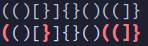
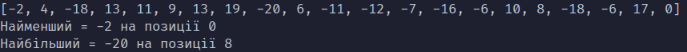
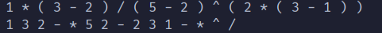

# Задачі №2

## 1)
Вводимо рядок після чого програма виводить той же рядок із підкресленими неправильними дужками

## 2)
Дана послідовність ненульових цілих чисел. Ознакою кінця послідовності є число 0. Знайдіть серед них перший найбільший (найменший) по модулю від’ємний елемент. Якщо такого елемента немає, то виведіть повідомлення про це.

## 3)
Реалізуйте алгоритми обчислення арифметичних виразів – перетворення в постфіксну форму, обчислення постфіксного виразу.

## 4)
Напишіть програму, що моделює чергу покупців в каси в магазині. Програма повинна відображати вміст відразу декількох черг. Новий покупець переміщується в чергу натисканням клавіші. Ви повинні самостійно визначити, яким чином він буде вибирати чергу. Обслуговування кожного покупця має випадкову тривалість (в залежності від кількості товарів в кошику). Обслужені покупці видаляються з черги.

## 5)
Реалізуйте основні операції із списками, стеками та чергами (за матеріалами лекцій).